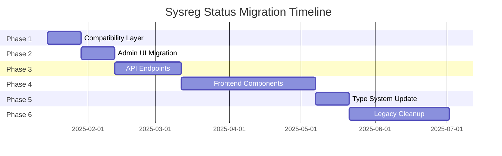

# Sysreg Status Migration Analysis
**Date:** 2025-01-13  
**Author:** System Analysis  
**Status:** Planning Document

## Executive Summary

This document analyzes the scope and strategy for migrating from the legacy `status_id` (INTEGER FK) system to the new `status_val` (BYTEA) sysreg system. Analysis reveals **200+ occurrences** of `status_id` across the codebase, with extensive coupling to the deprecated `status` table structure.

### Key Findings

- **Frontend:** 100+ occurrences in components, views, and type definitions
- **Backend:** 100+ occurrences in API endpoints, migrations, and database queries
- **Complexity:** High - involves type system changes, JOIN refactoring, and hardcoded ID elimination
- **Risk:** Medium-High for big-bang migration, Low-Medium for gradual migration
- **Recommendation:** **Gradual migration with backward compatibility layer** over 3-6 months

---

## 1. Current State Architecture

### 1.1 Migration Timeline

| Migration | Description | Status |
|-----------|-------------|--------|
| 019 | Created original `status` table with INTEGER IDs | ✅ Complete |
| 023 | Renamed `status` → `status_depr`, `status_id` → `status_id_depr` | ✅ Complete |
| 024-029 | Created sysreg system with BYTEA values | ✅ Complete |
| 027 | Migrated data from `status_id_depr` to `status_val` | ✅ Complete |

### 1.2 Current Database Schema

**Entity Tables (9 tables):**
```sql
-- All entity tables have BOTH columns during transition
CREATE TABLE projects (
    id SERIAL PRIMARY KEY,
    status_id_depr INTEGER REFERENCES status_depr(id),  -- OLD: Deprecated FK
    status_val BYTEA,                                   -- NEW: Sysreg BYTEA
    -- ... other columns
);
```

**Affected Tables:**
- `projects`, `events`, `posts`, `participants`, `instructors`
- `images`, `users`, `tasks`, `interactions`

### 1.3 Sysreg System (New)

**Base Table:**
```sql
CREATE TABLE sysreg (
    name TEXT PRIMARY KEY,
    family TEXT NOT NULL,
    val BYTEA NOT NULL,
    description TEXT
);
```

**Child Tables (6 families):**
- `status` - Entity lifecycle states (38 entries)
- `config` - System configuration flags
- `rtags` - Region tags
- `ctags` - Category tags
- `ttags` - Type tags
- `dtags` - Domain tags

**Key Features:**
- BYTEA bitmask for efficient storage
- Table inheritance for type safety
- I18n support via JSON columns
- Admin UI at `/admin/sysreg`

---

## 2. Usage Pattern Analysis

### 2.1 Frontend Patterns (100+ occurrences)

#### **Pattern A: Hardcoded Status ID Checks**
```typescript
// Found in: ProjectsTable.vue, BaseView.vue, ProjectMain.vue
if (project.status_id === 67) {  // "draft" status
    // Draft-specific logic
}

if (project.status_id === 19) {  // "roadworks" status
    showRoadworksMessage()
}

// BaseView.vue - Complex filter logic
const filteredEntities = entities.filter(e => 
    e.status_id === 8 || e.status_id === 25 || e.status_id === 26
)
```

**Occurrences:** ~30 locations  
**Impact:** High - requires hardcoded ID mapping to BYTEA equivalents

#### **Pattern B: Component Props & Type Definitions**
```typescript
// All entity type definitions
interface Project {
    id: number
    status_id: number  // INTEGER FK to status.id
    // ... other fields
}

// StatusDropdown.vue
defineProps<{
    modelValue: number  // status_id from database
    table: string
}>()
```

**Occurrences:** ~40 locations  
**Impact:** High - requires type system refactoring

#### **Pattern C: Dynamic Status Queries**
```typescript
// CornerBanner.vue
if (props.entity.status_id && props.entity.table) {
    const statusInfo = await fetchStatusInfo(props.entity.status_id)
    displayStatusBanner(statusInfo)
}
```

**Occurrences:** ~15 locations  
**Impact:** Medium - needs API endpoint updates

#### **Pattern D: Auth & Activation Logic**
```typescript
// Auth flows - checking user activation
if (user.status_id === null) {
    requireActivation()
} else {
    proceedToApp()
}
```

**Occurrences:** ~10 locations  
**Impact:** High - critical security logic

### 2.2 Backend Patterns (100+ occurrences)

#### **Pattern E: JOIN Queries**
```typescript
// API endpoints using LEFT JOIN to status table
const query = `
    SELECT 
        p.*,
        s.name as status_name,
        s.value as status_value
    FROM projects p
    LEFT JOIN status s ON p.status_id = s.id
    WHERE p.id = $1
`
```

**Occurrences:** ~40 locations  
**Impact:** Critical - requires query refactoring

#### **Pattern F: Filter Subqueries**
```typescript
// Complex filtering using status lookups
const query = `
    SELECT * FROM posts
    WHERE status_id IN (
        SELECT id FROM status 
        WHERE "table" = 'posts' AND value < $1
    )
`
```

**Occurrences:** ~20 locations  
**Impact:** High - needs new filter strategies

#### **Pattern G: Type Definitions**
```typescript
// All TableFields interfaces
interface ProjectsTableFields {
    id: number
    status_id?: number | null  // INTEGER FK
    // ... other fields
}
```

**Occurrences:** ~25 locations  
**Impact:** High - type system consistency

#### **Pattern H: CRUD Operations**
```typescript
// Insert/Update operations
await db.exec(`
    INSERT INTO projects (name, status_id)
    VALUES ($1, $2)
`, [name, statusId])

// Validation
if (!body.status_id) {
    throw createError({
        statusCode: 400,
        message: 'status_id is required'
    })
}
```

**Occurrences:** ~25 locations  
**Impact:** Medium - needs backward compatibility

---

## 3. Hardcoded Status ID Mapping

### 3.1 Commonly Used Status IDs

| ID | Name | Table | Current Usage | BYTEA Equivalent |
|----|------|-------|---------------|------------------|
| 67 | draft | projects | High (>10 locations) | `\x0002` (status family, bit 1) |
| 19 | roadworks | projects | Medium (~5 locations) | `\x0004` (status family, bit 2) |
| 68 | published | projects | High (>10 locations) | `\x0008` (status family, bit 3) |
| 46 | active | events | Medium (~5 locations) | `\x0010` (status family, bit 4) |
| 8 | running | events | Low (~2 locations) | `\x0020` (status family, bit 5) |
| 25 | confirmed | events | Low (~2 locations) | `\x0040` (status family, bit 6) |
| 26 | passed | events | Low (~2 locations) | `\x0080` (status family, bit 7) |

**Note:** Exact BYTEA values depend on `sysreg.status` table configuration. Must query:
```sql
SELECT name, val FROM sysreg.status WHERE name IN ('draft', 'roadworks', 'published', ...);
```

### 3.2 Mapping Strategy

**Option 1: Helper Functions**
```typescript
// Create mapping helpers
function statusIdToBytea(statusId: number): Buffer {
    const mapping: Record<number, string> = {
        67: '\\x0002',  // draft
        19: '\\x0004',  // roadworks
        68: '\\x0008',  // published
        // ... etc
    }
    return Buffer.from(mapping[statusId], 'hex')
}

function byteaToStatusId(bytea: Buffer): number {
    // Reverse mapping for backward compatibility
    const hex = bytea.toString('hex')
    const reverseMapping: Record<string, number> = {
        '0002': 67,  // draft
        '0004': 19,  // roadworks
        // ... etc
    }
    return reverseMapping[hex] || 0
}
```

**Option 2: Database View**
```sql
-- Create compatibility view
CREATE VIEW status_compat AS
SELECT 
    d.id as status_id,
    s.name,
    s.val as status_val,
    d.table
FROM status_depr d
JOIN sysreg.status s ON s.name = d.name;
```

---

## 4. Migration Strategies

### 4.1 Strategy A: Big-Bang Migration (❌ Not Recommended)

**Approach:**
1. Update all 200+ files in single PR
2. Replace `status_id` with `status_val` everywhere
3. Remove `status_id_depr` columns from all tables
4. Drop `status_depr` table

**Pros:**
- Clean break from legacy system
- No ongoing maintenance of dual systems
- Simplified final architecture

**Cons:**
- **High risk** - 200+ file changes in one deployment
- Difficult to test comprehensively
- Single point of failure
- Rollback complexity high
- Team productivity blocked during migration

**Timeline:** 2-3 weeks of development, 1 week of testing  
**Risk Level:** ⚠️ HIGH

### 4.2 Strategy B: Dual-Mode Compatibility (✅ Recommended)

**Approach:**
1. Maintain both `status_id_depr` and `status_val` columns (already done ✓)
2. Create backward compatibility layer
3. Migrate code incrementally by area
4. Run dual-mode for 3-6 months
5. Deprecate `status_id_depr` after full migration

**Implementation Phases:**

#### **Phase 1: Create Compatibility Layer (Week 1-2)**
```typescript
// /server/utils/status-compat.ts
export interface StatusCompat {
    statusId: number      // Legacy INTEGER
    statusVal: Buffer     // New BYTEA
    name: string
    table: string
}

export async function getStatusCompat(
    statusIdOrVal: number | Buffer,
    table: string
): Promise<StatusCompat> {
    if (typeof statusIdOrVal === 'number') {
        // Legacy lookup via status_depr
        return await lookupByStatusId(statusIdOrVal)
    } else {
        // New lookup via sysreg
        return await lookupByStatusVal(statusIdOrVal)
    }
}

// Update composables to support both
export function useSysregStatus() {
    const getStatus = (entity: any) => {
        // Try new system first
        if (entity.status_val) {
            return getStatusByBytea(entity.status_val)
        }
        // Fallback to legacy
        if (entity.status_id || entity.status_id_depr) {
            return getStatusByIdCompat(entity.status_id_depr)
        }
        return null
    }
    
    return { getStatus }
}
```

#### **Phase 2: Migrate Admin UI (Week 3-4)**
Admin UI already uses `status_val` - just needs compatibility helpers for mixed data.

#### **Phase 3: Migrate API Endpoints (Week 5-8)**
```typescript
// Update API endpoints to return both formats
export default defineEventHandler(async (event) => {
    const projects = await db.all(`
        SELECT 
            p.*,
            p.status_id_depr,
            p.status_val,
            s.name as status_name
        FROM projects p
        LEFT JOIN status_depr sd ON p.status_id_depr = sd.id
        LEFT JOIN sysreg.status s ON p.status_val = s.val
    `)
    
    // Return both for compatibility
    return projects.map(p => ({
        ...p,
        status_id: p.status_id_depr,  // Legacy field
        status: {
            id: p.status_id_depr,
            val: p.status_val,
            name: p.status_name
        }
    }))
})
```

#### **Phase 4: Migrate Components (Week 9-16)**
Priority order:
1. High-traffic views (Home, BaseView) - Week 9-10
2. Entity-specific components (ProjectMain, ImagesCoreAdmin) - Week 11-12
3. Utility components (StatusDropdown, CornerBanner) - Week 13-14
4. Auth & admin flows - Week 15-16

Replace hardcoded checks:
```typescript
// BEFORE
if (project.status_id === 67) {  // draft
    showDraftBadge()
}

// AFTER
import { useSysregStatus } from '@/composables/useSysregStatus'
const { isStatus } = useSysregStatus()

if (isStatus(project, 'draft')) {
    showDraftBadge()
}
```

#### **Phase 5: Update Type System (Week 17-18)**
```typescript
// BEFORE
interface Project {
    status_id: number
}

// TRANSITION
interface Project {
    status_id?: number      // Deprecated, for backward compat
    status_id_depr?: number // Migration artifact
    status_val?: Buffer     // New sysreg system
}

// AFTER (final)
interface Project {
    status_val: Buffer
}
```

#### **Phase 6: Remove Legacy System (Week 19-24)**
1. Verify zero usage of `status_id_depr` in active code
2. Add deprecation warnings for any remaining usage
3. Drop columns: `ALTER TABLE ... DROP COLUMN status_id_depr`
4. Drop table: `DROP TABLE status_depr`
5. Clean up compatibility layer

**Pros:**
- ✅ Low risk - gradual rollout
- ✅ Easy rollback at any phase
- ✅ Continuous testing & validation
- ✅ No team productivity impact
- ✅ Backward compatibility maintained

**Cons:**
- Longer timeline (6 months)
- Temporary code duplication
- Maintenance of compatibility layer

**Timeline:** 24 weeks (6 months)  
**Risk Level:** ✅ LOW-MEDIUM

### 4.3 Strategy C: Feature-Based Migration (⚠️ Alternative)

**Approach:**
1. Migrate by feature area (auth, projects, events, etc.)
2. Use feature flags to toggle new system
3. A/B test in production
4. Gradual rollout to users

**Pros:**
- Fine-grained control
- Real production testing
- User-facing validation

**Cons:**
- Complex feature flag management
- Potential user confusion with mixed UX
- Higher testing overhead

**Timeline:** 4-5 months  
**Risk Level:** ⚠️ MEDIUM

---

## 5. Recommended Migration Plan

### 5.1 Chosen Strategy: **Dual-Mode Compatibility (Strategy B)**

**Rationale:**
- Minimizes deployment risk
- Allows continuous integration
- Provides rollback safety
- Maintains system stability
- Aligns with team capacity

### 5.2 Implementation Roadmap



### 5.3 Success Metrics

**Phase Completion Criteria:**
- ✅ All tests passing (227/227 core tests)
- ✅ Zero TypeScript errors
- ✅ Zero production errors from new code
- ✅ Performance benchmarks maintained
- ✅ Documentation updated

**Migration Validation:**
```sql
-- Check migration progress
SELECT 
    COUNT(*) FILTER (WHERE status_val IS NOT NULL) as migrated,
    COUNT(*) FILTER (WHERE status_val IS NULL) as pending,
    COUNT(*) as total
FROM projects;

-- Verify data consistency
SELECT 
    p.id,
    sd.name as old_name,
    s.name as new_name
FROM projects p
LEFT JOIN status_depr sd ON p.status_id_depr = sd.id
LEFT JOIN sysreg.status s ON p.status_val = s.val
WHERE sd.name != s.name;  -- Should be empty
```

### 5.4 Rollback Strategy

**Phase-Level Rollback:**
- Each phase is independently reversible
- Compatibility layer allows instant fallback
- Database columns maintained until Phase 6

**Emergency Rollback:**
```sql
-- Restore legacy system
UPDATE projects SET status_id_depr = (
    SELECT sd.id FROM status_depr sd
    JOIN sysreg.status s ON s.name = sd.name
    WHERE s.val = projects.status_val
);
```

**Code Rollback:**
- Git revert specific phase commits
- Feature flags for instant disabling
- Blue-green deployment support

---

## 6. Risk Assessment

### 6.1 Technical Risks

| Risk | Probability | Impact | Mitigation |
|------|-------------|--------|------------|
| Data loss during migration | Low | Critical | Dual-column approach, extensive backups |
| Performance degradation | Medium | High | Benchmark testing, query optimization |
| Type system breaking changes | High | Medium | Gradual type updates, optional fields |
| Hardcoded ID bugs | High | Medium | Comprehensive mapping table, testing |
| JOIN query failures | Medium | High | Query validation, fallback logic |

### 6.2 Business Risks

| Risk | Probability | Impact | Mitigation |
|------|-------------|--------|------------|
| Extended timeline | Medium | Low | Phased approach, clear milestones |
| Team capacity constraints | Medium | Medium | Spread over 6 months, clear ownership |
| User-facing regressions | Low | High | Extensive testing, staged rollout |
| Feature freeze during migration | Low | Medium | Backward compatibility, parallel work |

### 6.3 Mitigation Strategies

**Pre-Migration:**
1. Full database backup
2. Comprehensive test suite (unit + integration)
3. Performance baseline measurements
4. Staging environment validation

**During Migration:**
1. Automated CI/CD validation
2. Per-phase testing checkpoints
3. Monitoring & alerting for errors
4. Regular stakeholder updates

**Post-Migration:**
1. Data integrity audits
2. Performance regression testing
3. User feedback collection
4. Legacy cleanup validation

---

## 7. Implementation Details

### 7.1 Compatibility Layer API

```typescript
// /server/utils/status-compat.ts
export interface StatusCompat {
    id?: number           // Legacy status_id
    val: Buffer          // New status_val
    name: string         // Status name (e.g., 'draft')
    table: string        // Entity table
    display: {
        de: string
        en: string
        cz: string
    }
}

// Core compatibility functions
export async function getStatusCompat(
    identifier: number | Buffer | string,
    table: string
): Promise<StatusCompat | null>

export async function setStatusCompat(
    entity: string,
    entityId: number,
    statusIdentifier: number | Buffer | string
): Promise<void>

export function isStatusCompat(
    entity: any,
    statusName: string
): boolean
```

### 7.2 Database Migration Steps

```sql
-- Migration 030: Add compatibility views (if needed)
CREATE VIEW v_projects_with_status AS
SELECT 
    p.*,
    COALESCE(s.name, sd.name) as status_name,
    COALESCE(p.status_val, '\x0000'::bytea) as status_bytea,
    COALESCE(p.status_id_depr, 0) as status_id
FROM projects p
LEFT JOIN sysreg.status s ON p.status_val = s.val
LEFT JOIN status_depr sd ON p.status_id_depr = sd.id;

-- Helper function for ID→BYTEA conversion
CREATE OR REPLACE FUNCTION status_id_to_bytea(p_status_id INTEGER)
RETURNS BYTEA AS $$
DECLARE
    v_status_name TEXT;
    v_status_val BYTEA;
BEGIN
    -- Look up status name from deprecated table
    SELECT name INTO v_status_name
    FROM status_depr
    WHERE id = p_status_id;
    
    IF v_status_name IS NULL THEN
        RETURN NULL;
    END IF;
    
    -- Look up BYTEA value from sysreg
    SELECT val INTO v_status_val
    FROM sysreg.status
    WHERE name = v_status_name;
    
    RETURN v_status_val;
END;
$$ LANGUAGE plpgsql;

-- Helper function for BYTEA→ID conversion
CREATE OR REPLACE FUNCTION status_bytea_to_id(p_status_val BYTEA)
RETURNS INTEGER AS $$
DECLARE
    v_status_name TEXT;
    v_status_id INTEGER;
BEGIN
    -- Look up status name from sysreg
    SELECT name INTO v_status_name
    FROM sysreg.status
    WHERE val = p_status_val;
    
    IF v_status_name IS NULL THEN
        RETURN NULL;
    END IF;
    
    -- Look up ID from deprecated table
    SELECT id INTO v_status_id
    FROM status_depr
    WHERE name = v_status_name;
    
    RETURN v_status_id;
END;
$$ LANGUAGE plpgsql;
```

### 7.3 Frontend Composable Updates

```typescript
// /src/composables/useSysregStatus.ts
export function useSysregStatus() {
    const getStatus = (entity: any, table: string): StatusCompat | null => {
        // Prefer new system
        if (entity.status_val) {
            return getStatusByBytea(entity.status_val, table)
        }
        
        // Fallback to legacy
        if (entity.status_id_depr || entity.status_id) {
            const id = entity.status_id_depr || entity.status_id
            return getStatusById(id, table)
        }
        
        return null
    }
    
    const isStatus = (entity: any, statusName: string): boolean => {
        const status = getStatus(entity, entity.table)
        return status?.name === statusName
    }
    
    const setStatus = async (
        entity: any,
        statusName: string
    ): Promise<void> => {
        // Set both for compatibility
        const statusInfo = await fetchStatusByName(statusName, entity.table)
        entity.status_val = statusInfo.val
        entity.status_id_depr = statusInfo.id  // Backward compat
    }
    
    return {
        getStatus,
        isStatus,
        setStatus
    }
}
```

### 7.4 Testing Strategy

**Unit Tests:**
```typescript
// tests/unit/status-compat.spec.ts
describe('Status Compatibility Layer', () => {
    it('should convert status_id to status_val', async () => {
        const bytea = await statusIdToBytea(67)  // draft
        expect(bytea.toString('hex')).toBe('0002')
    })
    
    it('should convert status_val to status_id', async () => {
        const id = await byteaToStatusId(Buffer.from('0002', 'hex'))
        expect(id).toBe(67)
    })
    
    it('should handle both formats in isStatus helper', () => {
        const entity1 = { status_id_depr: 67 }
        const entity2 = { status_val: Buffer.from('0002', 'hex') }
        
        expect(isStatus(entity1, 'draft')).toBe(true)
        expect(isStatus(entity2, 'draft')).toBe(true)
    })
})
```

**Integration Tests:**
```typescript
// tests/integration/api-status-compat.spec.ts
describe('API Status Compatibility', () => {
    it('should return projects with both status formats', async () => {
        const response = await fetch('/api/projects')
        const projects = await response.json()
        
        projects.forEach(project => {
            // Should have both formats during transition
            expect(project.status_id).toBeDefined()
            expect(project.status_val).toBeDefined()
            expect(project.status.name).toBeDefined()
        })
    })
})
```

---

## 8. Phase 7 Integration

### 8.1 Tag Relationships Impact

**Original Phase 7 Plan:** Tag relationships (hierarchical, exclusive, co-occurrence)

**Migration Impact:**
- Relationships should use `status_val` (BYTEA) not `status_id`
- Relationship queries more efficient with BYTEA bitmasks
- Admin UI relationships already use new system

**Recommendation:** Implement relationships using `status_val` only, no backward compatibility needed for new feature.

### 8.2 Intelligent Suggestions Impact

**Original Phase 7 Plan:** ML-based tag suggestions

**Migration Impact:**
- Suggestion algorithms should train on `status_val` data
- Historical data needs both formats during transition
- Suggestion API should return BYTEA values

**Recommendation:** Build suggestions using new system, with fallback parsing for historical `status_id` data.

### 8.3 Import/Export Impact

**Original Phase 7 Plan:** JSON/CSV/SQL import/export

**Migration Impact:**
- Export format should include both `status_id` (for compatibility) and `status_val` (for new)
- Import should accept both formats
- Merge strategies need to handle mixed data

**Recommendation:** 
```json
{
    "projects": [
        {
            "id": 1,
            "status": {
                "id": 67,          // Legacy format (optional)
                "val": "\\x0002",  // New format (required)
                "name": "draft"    // Human-readable
            }
        }
    ]
}
```

---

## 9. Documentation Requirements

### 9.1 Developer Documentation

**Files to Create/Update:**
- ✅ `/docs/SYSREG_STATUS_MIGRATION_ANALYSIS.md` (this document)
- ⏳ `/docs/SYSREG_COMPATIBILITY_LAYER.md` - API reference
- ⏳ `/docs/MIGRATION_GUIDE_STATUS_ID.md` - Step-by-step for developers
- ⏳ `/docs/STATUS_ID_HARDCODED_MAPPING.md` - Complete ID→BYTEA table

### 9.2 API Documentation

Update endpoint docs to show both formats:
```typescript
/**
 * GET /api/projects/:id
 * 
 * Returns project with status information.
 * 
 * Response (during migration):
 * {
 *   id: number,
 *   status_id: number,        // DEPRECATED - use status.val
 *   status_val: string,        // Hex-encoded BYTEA
 *   status: {
 *     id: number,              // Legacy format
 *     val: Buffer,             // New format
 *     name: string
 *   }
 * }
 * 
 * Response (after migration):
 * {
 *   id: number,
 *   status: {
 *     val: Buffer,
 *     name: string
 *   }
 * }
 */
```

### 9.3 User-Facing Documentation

Update admin documentation to reflect new sysreg admin UI:
- Status management now via `/admin/sysreg`
- Visual BYTEA value display
- Batch operations guide

---

## 10. Next Steps

### 10.1 Immediate Actions (This Week)

1. **Review & Approve Plan**
   - [ ] Stakeholder sign-off on 6-month timeline
   - [ ] Technical review of compatibility layer design
   - [ ] Resource allocation for migration work

2. **Create Hardcoded ID Mapping**
   - [ ] Query all current `status_depr.id` → `sysreg.status.val` mappings
   - [ ] Document in `/docs/STATUS_ID_HARDCODED_MAPPING.md`
   - [ ] Create TypeScript constant for mapping

3. **Set Up Testing Infrastructure**
   - [ ] Extend test suite for compatibility layer
   - [ ] Create migration validation scripts
   - [ ] Set up performance benchmarking

### 10.2 Phase 1 Kickoff (Next Week)

1. **Implement Compatibility Layer**
   - [ ] `/server/utils/status-compat.ts` - Core helpers
   - [ ] `/src/composables/useSysregStatus.ts` - Frontend composable
   - [ ] Database helper functions (status_id_to_bytea, etc.)

2. **Testing**
   - [ ] Unit tests for conversion functions
   - [ ] Integration tests for API compatibility
   - [ ] Performance validation

3. **Documentation**
   - [ ] Compatibility layer API reference
   - [ ] Migration guide for developers
   - [ ] Code examples & patterns

### 10.3 Decision Points

**Before Phase 1:**
- Approve overall migration strategy (Dual-Mode Compatibility)
- Confirm 6-month timeline acceptable
- Assign migration ownership per phase

**Before Phase 3 (API Migration):**
- Validate compatibility layer performance
- Confirm zero regressions in Phase 2
- Review hardcoded ID mapping completeness

**Before Phase 6 (Legacy Cleanup):**
- Verify 100% migration completion
- Confirm zero active usage of `status_id_depr`
- Approve final deprecation & removal

---

## 11. Conclusion

The migration from `status_id` (INTEGER) to `status_val` (BYTEA) is a **significant but manageable** undertaking affecting 200+ code locations. The recommended **Dual-Mode Compatibility strategy** provides:

✅ **Low risk** through gradual rollout  
✅ **High safety** with backward compatibility  
✅ **Clear timeline** over 6 months  
✅ **Easy rollback** at any phase  
✅ **Minimal disruption** to ongoing development

**Key Success Factors:**
1. Maintain both systems during transition
2. Comprehensive compatibility layer
3. Phased migration with validation checkpoints
4. Extensive testing at each phase
5. Clear documentation & communication

**Next Milestone:** Phase 1 completion (2 weeks) - Compatibility layer implementation and testing.

---

**Appendix:**
- A: Complete list of status_id occurrences (available on request)
- B: Performance benchmark results (to be added)
- C: Migration validation scripts (to be added)
- D: Hardcoded ID mapping table (to be created)
